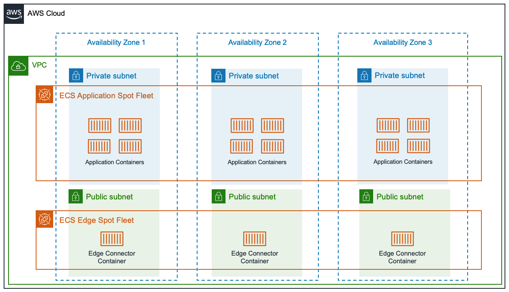

# ECS Edge Connector for AWS

## What Is This?

An integration combining ECS service discovery and the Linux `socat` utility for simple, service-aware port forwarding.

It is designed for use with a containerized network edge/perimeter to route incoming connections (generally from an external or public source _outside_ of the VPC) to a container service only available internally on the VPC.

## Background

For web applications, typically you could consider using an Application Load Balancer (ALB) on port 443.

For non-web applications such SFTP and SMTP, you could consider using a Network Load Balancer (NLB). In practice, I have found the behavior of NLBs to be really inconsistent especially for long-lived connections, or applications that use connection pooling. This can be very difficult to debug because NLBs are designed to be simple to use, and hide the complexity needed to troubleshoot problems. As an example, handling pooled LDAP/Active Directory connections through an NLB was problematic and unreliable.

I attempted a second variation on solving this problem using HAProxy, but working with long-lived connections remained a problem. As an example, long-running SFTP transfers may be arbitrarily terminated despite data actively moving across the connection, and client/server timeouts set properly.

Wanting to find a port forwarding solution that was as simple as possible, and one that could be containerized, I happened upon [socat](http://www.dest-unreach.org/socat/) - a Linux "Swiss army knife" for networking. Socat can be configured to listen for incoming connections, and hand those connections off to an executable as a forked subprocess. In this specific case, the executable is another script that first queries DNS for a random healthy target, and then passes on the incoming connection. Any DNS A or SRV records will work, but it is purposely tested with DNS records in Route53 created by ECS service discovery.

Lightning fast, and very easy to debug.

## Example Architecture

Simplified overview of how the edge connector is deployed. Application containers are deployed on ECS hosts which are private only, and while other group of ECS hosts are created to live in public subnets at the edge to receive and route incoming traffic.



## Example CloudFormation Deployment

```yaml
Resources:
  EdgeConnectorTaskDefinition:
    Type: "AWS::ECS::TaskDefinition"
    Properties:
      Family: your-ecs-family-name
      NetworkMode: host
      ContainerDefinitions:
        - Name: socat
          Image: "your-ecs-repo/ecs-edge-connector:2020-03-23.104457"
          MemoryReservation: 64
          Environment:
            # What port should the edge connector listen on for connections?
            - Name: LISTENER_PORT
              Value: 20001

            # Name of the ECS service as published to Route53
            - Name: ECS_SERVICE_DISCOVERY_TARGET
              Value: yourservice.tld

            # Optional, only needed if using A records
            - Name: TARGET_PORT
              Value: 2222
          HealthCheck:
            Command: ["CMD-SHELL", "exit 0"]
            Timeout: 10
            StartPeriod: 10

  EdgeConnectorServiceDefinition:
    Type: "AWS::ECS::Service"
    Properties:
      Cluster: your-ecs-cluster
      SchedulingStrategy: DAEMON
      TaskDefinition: !Ref EdgeConnectorTaskDefinition
      PlacementConstraints:
        - { Type: distinctInstance }
        - { Type: memberOf, Expression: "attribute:environment == production-edge" }
```

## License 
 
BSD. See [LICENSE.md](./LICENSE.md).

## Building and Development

A [Makefile](./Makefile) is provided with build targets to build the Docker image, and publish it to a repository. We use AWS ECR, but adjust your configuration to taste.

The base Docker image is [Alpine Linux 3.11](https://alpinelinux.org/).